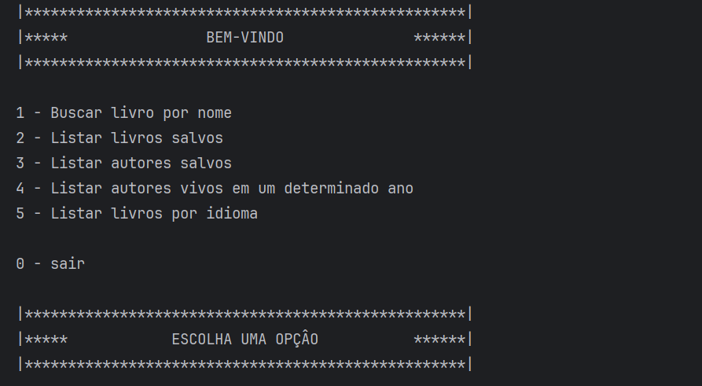

  

<h5 align="center"> 
  <b>✅ Completo</b> | <b>✅ Funcional</b>

  

</h5>

O **Find Book** é uma aplicação em Java que permite aos usuários buscar, gerenciar e organizar informações sobre livros e autores. Utilizando integração com a API do projeto [Gutendex](https://gutendex.com/), a aplicação oferece funcionalidades como busca por livros, listagem de autores e livros salvos, e filtragem por idiomas.

---

  
  ## Demonstração
  
  

## 📋 Funcionalidades

1. **Buscar Livro por Nome**  
   Permite ao usuário buscar um livro utilizando o nome. Os dados são consultados na API do Gutendex e, caso encontrados, são convertidos e salvos no banco de dados local.

2. **Listar Livros Salvos**  
   Exibe todos os livros armazenados no banco de dados, ordenados por título.

3. **Listar Autores Salvos**  
   Lista todos os autores presentes no banco de dados, ordenados por nome.

4. **Listar Autores Vivos em um Determinado Ano**  
   Permite filtrar autores que estavam vivos em um ano específico, considerando os anos de nascimento e falecimento.

5. **Listar Livros por Idioma**  
   Filtra livros armazenados no banco de dados pelo idioma escolhido pelo usuário.

6. **Salvar Dados no Banco de Dados**  
   Os livros e autores retornados da API são validados e salvos no banco de dados caso ainda não estejam cadastrados.

7. **Menu Interativo**  
   Interface de linha de comando (CLI) que guia o usuário através das opções disponíveis no sistema.

---

## 📂 Estrutura do Projeto

- **`br.com.robsonlmds.find_book.model`**  
  Contém as classes que representam os modelos de dados, como `Livro`, `Autor` e `DadosLivro`.

- **`br.com.robsonlmds.find_book.repository`**  
  Interfaces que definem os métodos para interação com o banco de dados (`iLivrosRepository` e `iAutorRepository`).

- **`br.com.robsonlmds.find_book.service`**  
  Serviços responsáveis por consumir a API externa e converter os dados recebidos.

- **`br.com.robsonlmds.find_book.principal`**  
  Classe principal que implementa o menu e a lógica de interação com o usuário.

---

## 🛠️ Tecnologias Utilizadas

- **Java 17**
- **API REST - Gutendex**  
  Para busca de livros e autores.
- **JPA (Java Persistence API)**  
  Para integração com o banco de dados.
- **Biblioteca Scanner**  
  Para interação com o usuário via CLI.

--- 

## 👩🏻‍💻 Autor  

<table>
  <tr>
    <td align="center">
      <a href="https://github.com/robsonlmds">
         
        
          <b>Robson Lucas Messias</b>
        
      </a>
    </td>
  </tr>
</table>

 
<h4 align="center">
  Made by: Robson Lucas Messias | <a href="mailto:robsonlmds@hotmail.com">Contato</a>
</h4>

  

<h1 align="center">

</h1>
